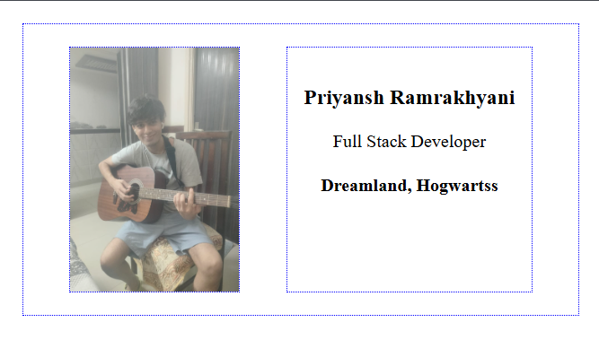

# Business Card Project

## HTML File Paths 💯 -
|Path|Description|
| --- | --- |
|``|The "picture.jpg" file is located in the same folder as the current page.|
|``|The "picture.jpg" file is located in the images folder in the current folder.|
|``|The "picture.jpg" file is located in the images folder at the root of the current web.|
|``|The "picture.jpg" file is located in the folder one level up from the current folder.|

### ☺️ Relative Path Syntax -
- ./ - Start from the same directory the current file is in. It is the same as not writing ./ and just writing images/me.png (if me.png is inside images folder).
- ../ - Move one directory up from the current directory.
- / - Start from the root directory of the project (without worrying about going up so many directories and then go down so many directories). 👍

> Note : Also treat the vscode foldersetup as a root directory(a directory in itself, call it project root directory). 

> [!NOTE]
> To link script, we use the `<script src="???"></script>` tag.

> [!TIP]
> Writing good alt texts for the img tag -
> 1. Don't include 'image of'.
> 2. Be concise (<125 characters).
> 3. Describe it as if you are describing it 'over a phone'.

## Basic HTML Structure for our project 📽️ -
``` html
<html>
    <head>
        <link rel="stylesheet" href="styles.css" />
    </head>
    <body>
        <div class="card">
            
            <h3>Priyansh Ramrakhyani</h3>
            <p>Full Stack Developer</p>
            <h4>Dreamland, Hogwarts</h4>
        </div>
    </body>
</html>
```

## Working with CSS 🎨 -

##### Give body element a margin of 20px
`body {margin: 20px;}`

##### Giving avatar a width so that it does not occupy a big space
`avatar {width: 150px;}`

#### More about the CSS flexbox to give the desired layout to the card
> [!IMPORTANT]
> Flexbox turns only its *direct childs* into columns.

##### Giving layout to the card using flexbox
Wrap the h3, p, h4 elements inside a div and make it the direct child of the card div, so that flexbox acts only on it's direct childs which are image and the newly created div.

``` html
<div class="card">
    
    <div>
        <h3>Priyansh Ramrakhyani</h3>
        <p>Full Stack Developer</p>
        <h4>Dreamland, Hogwarts</h4>
    </div>
</div>
```

And making the `card div` a flex container 🍽️

`.card {display: flex; justify-content: space-around; padding: 20px;}`

> [!NOTE]
> Utility Class = class for a single CSS property, like `.italic {font-style: italic;}`.
> Now we can reuse this class in our HTML file to make any text italic.

##### Add a utility class for the blue-dotted border property and give to the card and both it's direct children (flexbox children), we will use it to better understand the layout (another developer tool)

`.blue-dotted-border {border: 2px dotted blue;}` and then apply this class to the card and img and the div.

New HTML code with the utility class applied:
``` html
<html>
    <head>
        <link rel="stylesheet" href="styles.css" />
    </head>
    <body>
        <div class="card blue-dotted-border">
            
            <div class="blue-dotted-border text-block">
                <h3>Priyansh Ramrakhyani</h3>
                <p>Full Stack Developer</p>
                <h4>Dreamland, Hogwartss</h4>
            </div>
        </div>
    </body>
</html>
```

New CSS code with the utility class applied:
``` css
body {
    margin: 20px;
}

.avatar {
    width: 150px;
}

.card {
    padding: 20px;
    display: flex;
    justify-content: space-around;
}

.text-block {
    padding: 15px;
    text-align: center;;
}

.blue-dotted-border {
    border: 1px dotted blue;;
}
```

So, our output looks like this:
<div style="text-align: center;">
    
</div>

> [!NOTE]
> elements with `display: flex` are by default a block-level element. So, we don't need to add `display: block` to them, And thus our card set to `diplay: flex` will occupy all the available space in the parent element which is the horizontal space of the body.

###### We remember how to center a block element in CSS, that is, by setting `margin-left/right: suto` and `width: fixed-value`.

So, let's set our card to `width: 400px;` and `margin-left: auto; margin-right: auto;` to center it horizontally.

##### Another Concept at Hand ✋ - CSS Inheritance
- Helps Write DRYer(Don't Repeat Yourself) code. Example - We can center all the content/article by giving `text-align: center` to the article tag and wrap everything inside it.
- Fewer Bugs.
- Be more efficient.

> Note: Not all CSS properties get inherited down the tree 🌴.
> [List of Inheritable CSS Properties](https://stackoverflow.com/questions/5612302/which-css-properties-are-inherited).

Hence, To center the text, let's add `text-align: center` in the `card` class.

###### To add colors to our card, let's do the following changes -
- add `background-color: #ddebf8;` to our `card` class.
- add `color: #2b2839;` to our `card` class
- add `border-bottom: 7px solid #d8cefe;` to our `card` class. This adds a purplish border to the bottom of our card.

#### Let's talk about fonts for some time 🖋️ -

- Most servers send the fonts to the client's browser while sending the other files of the website.
- `Web Safe Fonts` are those fonts which are available already on the most client's computers. They are also known as `System Fonts`. List of them is [here](https://www.w3schools.com/cssref/css_websafe_fonts.php).

> To add fonts, we add `font-family: Verdana, Geneva, Tahoma, sans-serif;` to our body tag which is telling the browser to use the first available font from this `font-stack` and if none of them are available, use a sans-serif font.

* `Serif` fonts - Those which have curly litte endings.
* `Sans-serif` fonts - Those which don't have curly endings.Sans-serif meaning without serif.

### A little bit about margin and padding shorthands ✋-

- *margin shorthand* - `margin: top right bottom left;`. Just like how a **CLOCK** moves !
- *If we have same values for top and bottom and same values for right and left* - then we write `margin: top/bottom-value left/right-value;`. SO, first value controls the y-axis and the second value controls the x-axis.

SO, let's remove `margin-left: auto;` and `margin-right: auto` in our card class, and replace it with `margin: 0 auto;` just like how the pros center the margins. 🫡

## So, The Final CODE 🥇- 
HTML CODE: 
``` html
<html>
    <head>
        <link rel="stylesheet" href="styles.css" />
        <link rel="preconnect" href="https://fonts.googleapis.com">
        <link rel="preconnect" href="https://fonts.gstatic.com" crossorigin>
        <link href="https://fonts.googleapis.com/css2?family=Montserrat:ital,wght@0,426;1,426&display=swap" rel="stylesheet">
    </head>
    <body>
        <div class="card">
            
            <div class="card-content">
                <h2>Priyansh Ramrakhyani</h2>
                <p>Full Stack Developer</p>
                <h4>Dreamland, Hogwarts</h4>
            </div>
        </div>
    </body>
</html>
```

CSS CODE:
``` css
body {
    margin: 20px;
    /*Using google fonts for better-looking font*/
    font-family: "Montserrat", sans-serif;
    font-optical-sizing: auto;
    font-weight: 426;
    font-style: normal;
}

.avatar {
    border-radius: 10px;
    width: 150px;
}

.card {
    width: 400px;
    margin: 0 auto; /* Pro way of using margins, here it centers the card */ 
    padding: 20px;
    display: flex;
    justify-content: space-around;
    text-align: center;
    background: #ddebf8;
    color: #2b2839;
    border-bottom: 8px solid #ffc8dd;
    border-radius: 20px;
    transition: box-shadow 0.6s ease-in-out;
}

.card-content {
    margin-top: auto;
    margin-bottom: auto;
}

.card:hover { /*Hover effect for the card*/
    box-shadow: 0 4px 8px 0 rgba(0, 0, 0, 0.2), 0 6px 20px 0 rgba(0, 0, 0, 0.19);
}

/* A utilty class for a blue dotted border */
/* .blue-dotted-border {
    border: 1px dotted blue;;
} */
```

Final Output 🥈-
